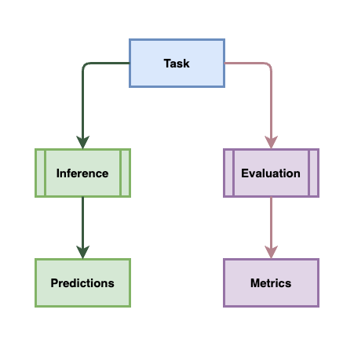
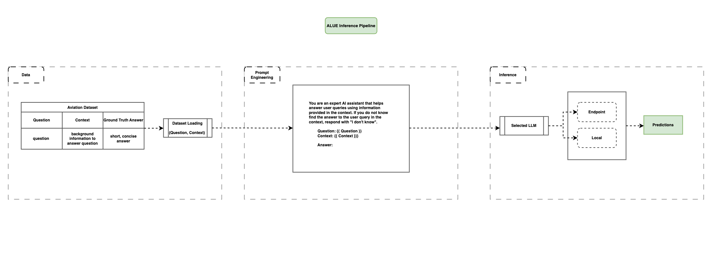
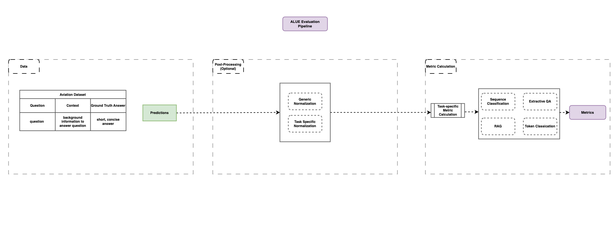

This is the copyright work of The MITRE Corporation, and was produced for the U. S. Government under Contract Number 693KA8-22-C-00001, and is subject to Federal Aviation Administration Acquisition Management System Clause 3.5-13, Rights In Data-General, Alt. III and Alt. IV (Jan 2009). No other use other than that granted to the U. S. Government, or to those acting on behalf of the U. S. Government, under that Clause is authorized without the express written permission of The MITRE Corporation. For further information, please contact The MITRE Corporation, Contracts Management Office, 7515 Colshire Drive, McLean, VA 22102-7539, (703) 983-6000. 2024 The MITRE Corporation. © All Rights Reserved.


# Aviation Language Understanding Evaluation (ALUE)

ALUE (Aviation Language Understanding Evaluation) is a comprehensive framework designed to facilitate the evaluation and inference of Language Learning Models (LLMs) on aviation-specific datasets. The framework is user-friendly and versatile, supporting custom datasets, preferred models, user-defined prompts, and quantitative metrics of performance.

ALUE provides users with the ability to run both inference and evaluation, separately or together, depending on preference. At a high-level, this diagram represents the flow for each task.




## Key Components
### Task
This represents the language task the user wants to test.

### Inference
This involves the steps to generate predictions from the dataset using various LLMs.

### Predictions
These are the outputs of the inference process.

### Evaluation
This Involves the steps to evaluate the predictions against the ground truth and calculate metrics

### Metrics
These are the results of the evaluation process, detailing the performance of the model


### Inference Pipeline Overview

The ALUE inference pipeline allows users to quickly generate predictions for their datasets without needing extensive setup. This pipeline supports custom datasets, preferred models, and user-defined prompts, making it versatile and user-friendly.

The ALUE inference pipeline is ideal for users who do not have an existing inference setup and wish to leverage a pre-built solution. This pipeline simplifies the process of generating predictions, allowing users to focus on analyzing results rather than setting up infrastructure.

Inference pipline, illustrated:


#### Detailed Steps

##### Dataset Loading
This involves loading the aviation dataset in the formats defined by ALUE, as shown above. The format has three fields: question, context, and ground truth answer.

##### Prompt Engineering

This involves configuring the prompt by populating it with the desired input fields. For example: the prompt can be populated with the question and context fields, as shown above. ALUE also supports few-shot examples that can be dynamically included in the prompt.

##### Running Inference
This involves selecting a desired LLM for inference. ALUE supports running models locally (either full or quantized with bitsandbytes) or via a Huggingface TGI endpoint. Generation keyword arguments can also be set up to enable greater control over model outputs.

##### Predictions Storage

This involves storing the predictions from the inference pipeline in a prediction.json file. This file requires fields for the question ID and the generated answer.

Fields: This file will include fields for the question ID and the generated answer. This should be stored in a `predictions.json` file.

### Evaluation Pipeline Overview

The ALUE evaluation pipeline enables users to generate performance metrics for their Language Learning Model (LLM) on specified language tasks. Given the non-deterministic nature of generative LLMs, ALUE has adopted an approach that constrains language tasks to elicit short, concise answers. This approach allows us to assess the LLM’s understanding of domain-specific information and its ability to accurately use that information to produce correct responses.

ALUE supports automated metric calculations for F1-score, Precision, Recall, Accuracy, and Exact Match across various tasks. While these metrics may not fully capture the performance of a generative LLM, they provide a reasonable baseline understanding of performance, especially when the task is designed to be challenging yet measurable through short, concise answers.

Evaluation pipline, illustrated:


#### Detailed Steps

##### Load Predictions

This involves load the predictions from the predictions.json file. This file can either be provided by the user, derived from their own inference pipeline, or generated using the ALUE inference pipeline. The predictions.json file should always adhere to the specified format

##### Load Ground Truth

This involves loading the ground truth data for the aviation dataset in the required format as shown in the sample format below for a classification task

##### Post-Processing
This involves applying any necessary generic or task-specific post-processing steps to prepare results for evaluation.

##### Metric Calculation
This involves calculating the appropriate metrics based on the specific language task.


##### Metric Storage
This involves storing the calculated metrics in the `full_metrics.json` file within the designated directory for the final results.


This script is used to perform evaluation on LLMs. It supports several types of models: `roberta`, `mistral-7b-instruct-v0.1`, `mistral-7b-instruct-v0.2`, `mixtral-8x7b-instruct-v0.1`, `aviation_Mistral-7B-v0.1`, and `llama-2-7b-chat-hf`.

---

## Environment setup

In your enviornment, make sure you have all the packages available. Run the following command to download any missing dependancies:

### For MacOS and Linux:
To set up your virtual enviornment
```
python -m venv alue_env
```
```
source alue_env/bin/activate
```
Install the required packages:

**NOTE: If you have `farm-haystack` installed, please uninstall it before installing requirements.**

```
pip uninstall farm-haystack
pip install -r requirements.txt
```

### For Windows:
To set up your virtual enviornment
```
python -m venv alue_env
```
```
alue_env\Scripts\activate
```
Install the required packages
```
pip uninstall farm-haystack
pip install -r requirements.txt
```


### Model Configuration

ALUE allows users to use LLMs on endpoints, self-hosted TGI Servers, or just locally using the GPUs available (full or quantized). Users will be able to decide how to run the models when launching any one of the scripts described below.

The full list of models supported should be added to the config.py script.

Example config.py script:

```python
MODELS = {
    "llama_2_7b_chat": "/projects/alue/models/Llama-2-7b-chat-hf",
    "llama_2_13b_chat": "/projects/alue/models/Llama-2-13b-chat-hf",
    "llama_2_70b_chat": {
        "aip_endpoint": "https://llama2-70b.k8s.tld",
        "local_path": ""
        },
    "mistral_v1": "/projects/alue/models/Mistral-7B-Instruct-v0.1",
    "mistral_v2": {
        "aip_endpoint": "https://mistral-7b.k8s.tld",
        "local_path": "/projects/alue/models/Mistral-7B-Instruct-v0.2",
    },
    "mixtral": {
        "aip_endpoint": "https://mixtral-8x7b.k8s.tld",
        "local_path": "/projects/alue/models/Mixtral-8x7B-Instruct-v0.1"
    },
}

EMBEDDING_MODELS = {
    "BAAI/bge-m3": {
        "aip_endpoint": "https://embeddings-bge.k8s.tld/",
        "local_path": ""
    }
}

USE_TGI = True
USE_AIP = False

```

#### Running Models locally

To run models locally, you need to have the model weights available on your local machine. You can specify the local path to the model weights in the `config.py` script.

For example: `"llama_2_7b_chat": "/projects/alue/models/Llama-2-7b-chat-hf"`


#### Text Generation Inference (TGI):

Text Generation Inference (TGI) is a toolkit for deploying and serving Large Language Models (LLMs). TGI enables high-performance text generation for the most popular open-source LLMs, including Llama, Falcon, StarCoder, BLOOM, GPT-NeoX, and T5. More info [here](https://huggingface.co/docs/text-generation-inference/en/index).

Using TGI can significantly speed up inference time.

On 586 questions with Mistral-7b-v0.1-Instruct:
Without TGI: 00:15:45

With TGI: 00:04:43

#### Setting up TGI

To use the TGI endpoint, first modify the `run_tgi.sh` file to configure it to your needs in terms of gpu usage. Then run the script with the name of the model as an argument. The name of the model is the model directory name in `/projects/alue/models`. For example, to run the TGI endpoint with Mistral V1, in `/projects/alue/models/Mistral-7B-Instruct-v0.1`, run the script as `sudo ./run_tgi.sh Mistral-7B-Instruct-v0.1`

**NOTE***: When running models quantized, add `quantize bitsandbytes-nf4` at the end of the `docker run command`. It wil look like the following:
```bash
docker run -d \
    --name tgi \
    --gpus all \
    --shm-size 1g \
    -p 3000:80 -v $volume:/data \
    --rm <docker_image_url>:$tgi_version \
    --model-id $model_id \
    --huggingface-hub-cache /data \
    --num-shard $num_shard \
    --max-input-length $max_input_length \
    --max-batch-prefill-tokens $max_batch_prefill_tokens \
    --max-total-tokens $max_total_tokens \
    --quantize bitsandbytes-nf4
```

Run the script once you have modified it with the following command:
```bash
sudo ./run_tgi.sh
```

#### Running Models on Endpoints

The current ALUE configuration allows users to run models on endpoints.

**Please note the endpoints have to be hosted via TGI**. This is a bit different than running the TGI local instance described above. The endpoints are accessible via the internet instead of running on localhost as with TGI local. The endpoints are listed in the `config.py` script.

If you have endpoints set up, ensure that the model has an associated `aip_endpoint` in the `config.py` script.

Example: `"llama_2_7b_chat": "https://llama-2-7b-chat.k8s.tld"`.

---

## Creating Prompt Templates

Prompt templates guide the model to generate desired outputs. We are using Jinja templates here which make it easy to build prompts with various inputs.

Here's an example:

```
<s>[INST] Using the information contained in the provided context, identify a concise, EXACT span of the context that answers the question. DO NOT provide sentence-long spans. Adhere to the stylistic guidelines provided in the question.

So for instance the following:

Example Inputs:

    Question: {{ example.question }}
    Context: {{ example.transcript }}

The answer to the following would be: [/INST]
{{ example.answer }}
</s>

[INST] Question: {{ query }}
Context: {{ context }}
Answer: [/INST]
```

In this template, `` is a loop that iterates over examples. `{{ example.question }}`, `{{ example.transcript }}`, and `{{ example.answer }}` are placeholders replaced with actual data at runtime.

`[INST]` and `[/INST]` tags indicate the instruction part of the prompt. `<s>` and `</s>` tags indicate the start and end of a sequence.

To create a new prompt template, follow the formatting guidance provided for the specific model, adjusting the instruction text and placeholders as needed. It is recommended to place Jinja2 templates in the `templates/` directory. Users will be able to pass the template path when launching the scripts described further down in the documentation.

---

## Adding New JSON Schemas for Structured Generation

JSON schemas define the structure of outputs generated by LLMs for specific tasks. By providing a schema, you ensure that model outputs are validated and formatted consistently, enabling reliable downstream processing.

**How to add a new JSON schema:**

1. **Create a Task Folder:**
   In the `schemas/` directory, create a new folder named after your task (e.g., `aviation_exam`).

2. **Add Your Schema:**
   Inside your task folder, add a JSON file containing your schema definition. Name the file appropriately (e.g., `mcqa_schema.json`).

**Example Directory Structure:**
```
schemas/
  aviation_exam/
    mcqa_schema.json
```

**Example: Multiple Choice Question Answering (MCQA) Schema**

Suppose you want to define a schema for a multiple-choice question answering task in the context of an aviation exam. Place this schema in `schemas/aviation_exam/mcqa_schema.json`:

```json
{
    "properties": {
        "selected_option": {
            "title": "Selected Option",
            "type": "string",
            "enum": ["A", "B", "C"]
        }
    },
    "required": ["selected_option"],
    "title": "MCQA",
    "type": "object"
}
```

---

By following these instructions, users can easily contribute new JSON schemas for any task, promoting consistency and extensibility in structured generation workflows.

---

## Dataset Requirements:
Before we pass our data in to our model, it is important to structure the data in a way that the extractive qa and classification evaluation scripts expect.

### Extractive QA Dataset
The extractive QA evaluation dataset (modeled after the SQuAD format) is a JSON file that follows a specific format to represent the context (which is the paragraph from which the answer is found), the question, and the answer. The structure is as shown below:
```json
{
    "version": "squad_v1",
    "data": [
        {
            "title": "title",
            "task": "task description.",
            "examples": [
                {
                    "question": "Question example. Provide an example question to illustrate the task.",
                    "transcript": "Transcript example. Provide a sample transcript to illustrate the context for the question.",
                    "answer": "Aanswer example. Provide a sample answer to illustrate the expected output."
                }
            ],
            "paragraphs": [
                {
                    "context": "Context for the question.",
                    "qas": [
                        {
                            "id": "unique_question_id_1",
                            "question": "question text",
                            "answers": [
                                {
                                    "text": "answer text"
                                }
                            ]
                        }
                    ]
                }
            ]
        }
    ]
}
```

**NOTE**: For `version_num`, the options are `squad_v1` or `squad_v2`. Use `squad_v2` when introducing unanswerable questions.

#### Explanation of Dataset Fields
`data`: An array containing the data for the evaluation.

`title`: The title of the document or the source from which the context is extracted from.

`examples`: An array of example questions, transcripts, and answers to illustrate the task.

`paragraphs`: An array of the contexts and thier associated question and answer.

`context`: The context paragraph from which the answer to the question can be extracted.

`qas`: An array of question, answer, and thier unique ID for a particular context.

`question`: The question related to the context.

`id`: A unique ID fr each question-answer-pair.

`answers`: An array that contains the answer for the question

`text`: The actual answer to the question.

#### Key Notes
* The `id` should be unique for each question.
* For evaluation, the `answers` array needs to contain the `text` only.

### Classification Dataset
The classification evaluation datasets have a custom data structure in a JSON file. The data structure specifies the task type, task background or description, task input-output examples, text to classify, and ground truth labels (if available). The structure is as shown below:
```json
{
    "data": [
        {
            "title": "Title",
            "classification_task": "Name of Classification Task",
            "task_background": "Description of Classification Task",
            "examples": [
                {
                    "Input": [
                        "Example text to classify"
                    ],
                    "Output": "Answer to example input"
                }
            ]
            "qas": [
                {
                    "id": "Unique Question ID",
                    "text_input": [
                        "Text to classify"
                    ],
                    "labels": "Answer in text"
                }
            ]
        }
    ]
}
```

#### Explanation of Dataset Fields
`data`: An array containing the data for the evaluation.

`title`: The title of the task

`classification_task`: The classification question, i.e. "Does the following transcript of an air traffic control radio transmission contain a pilot weather report? Output 1 for yes and 0 for no."

`task_background`: The background or description of the task that provides domain context, i.e. "A PIREP in air traffic control radio communications is a pilot report of in-flight weather (e.g. precipitation, fog, sandstorms), sky (e.g. cloud coverage), wind, atmospheric (e.g. temperature, icing), and/or flight (e.g. turbulence) conditions experienced by the pilot during his or her flight."

`examples`: An array of example text inputs and classification outputs

`qas`: An array of text inputs, classification outputs, and their unique IDs for a particular classification task.

`id`: A unique ID for each text_input and labels pair.

`text_input`: The text input to classify

`labels`: A string containing the expected classification output on the text input


### RAG Dataset
The RAG evaluation dataset is a JSON file that follows a specific format to represent the query, context, and the expected answer. The structure is as shown below:
```json
{
    "examples": [
        {
            "query": "Your query here",
            "context": "Relevant context here, including any metadata or additional information",
            "answer": "Expected answer here"
        },
        {
            "query": "Another query here",
            "context": "Relevant context here, including any metadata or additional information",
            "answer": "Expected answer here"
        }
        // Add more examples as needed
    ],
    "data": [
        {
            "title": "Title of the document or section",
            "paragraphs": [
                {
                    "qas": [
                        {
                            "id": "Unique ID for the question",
                            "question": "Question text here",
                            "answers": [
                                {
                                    "text": "Expected answer text here",
                                    "document_id": [
                                        "Document ID(s) associated with this answer"
                                    ]
                                }
                            ]
                        },
                        {
                            "id": "Another unique ID for a different question",
                            "question": "Another question text here",
                            "answers": [
                                {
                                    "text": "Expected answer text here",
                                    "document_id": [
                                        "Document ID(s) associated with this answer"
                                    ]
                                }
                            ]
                        }
                        // Add more Q&A pairs as needed
                    ]
                }
                // Add more paragraphs as needed
            ]
        }
        // Add more data sections as needed
    ]
}
```

#### Explanation of Dataset Fields
`examples`: An array containing example queries, contexts, and answers.

- `query`: The question or query that needs to be answered.
- `context`: The context or background information related to the query. This can include metadata or additional information that helps in understanding the query.
- `answer`: The expected answer to the query.

`data`: An array containing the data for the evaluation.

- `title`: The title of the document or section.
- `paragraphs`: An array of paragraphs within the document or section.
  - `qas`: An array of question-answer pairs within the paragraph.
    - `id`: A unique identifier for the question.
    - `question`: The question text.
    - `answers`: A list of expected answers to the question.
      - `text`: The expected answer text.
      - `document_id`: A list of document IDs associated with this answer.

#### Key Notes
* The `id` should be unique for each question.
* The `document_id` should reference the IDs of the documents from which the answer is derived.

This structure ensures that the input data is well-organized and can be easily processed by the RAG evaluation script.

## Per Task Breakdown

### Extractive QA
The extractive QA script is located in `scripts/extractive_qa.py`.

Run the script with the following arguments:

#### Arguments:


The script supports three modes: `inference`, `evaluation`, and `both`. Each mode has its own set of arguments.


##### Common Arguments:
```
-h, --help            show this help message and exit
-i INPUT_DATA_JSON_PATH, --input_data_json_path INPUT_DATA_JSON_PATH
                      provide the path for the input json data
-o OUTPUT_EVAL_RES_DIR, --output_eval_res_dir OUTPUT_EVAL_RES_DIR
                      provide the path for storing evaluation results
```

###### Inference Mode:

```
-m MODEL_TYPE, --model_type MODEL_TYPE
                      provide the model type (Options: see config.py)
-t, --use_tgi         whether to use TGI (default: False)
--tgi_endpoint        provide the TGI endpoint, if using TGI
-a, --use_aip         whether to use AIP endpoint (default: False)
-q, --quantized       whether to use quantized model (default: False)
--prompt-template PROMPT_TEMPLATE
                      path to prompt template file (NOTE: must match selected model)
--nbr_examples     number of examples to include in the prompt, (default: 10)
--randomize_selection     Specify whether the selection of examples should be randomized (default: False)
--randomize_order     Specify whether the ordering of examples should be randomized
--random_seed      Specify the number with which to seed the random selection of examples (default: 49)
```

###### Evaluation Mode:

```
--predictions_filename      Path to the predictions JSON file
```

###### Both Mode:
All arguments from both inference and evaluation modes.

**NOTE:If you are using TGI, please ensure the model_type that you choose here aligns with the model that you are running on the TGI endpoint.**

###### Running the script:

To run the script in `inference` mode:
```bash
python scripts/extractive_qa.py inference \
    -i <input_data_json_path> \
    -o <output_eval_res_dir> \
    -m <model_type> \
    -t \
    --prompt-template <prompt_template_path> \
    --nbr_examples <nbr_examples>
```


To run the script in `evaluation` mode:
```bash
python scripts/extractive_qa.py evaluation \
    -i <input_data_json_path> \
    -o <output_eval_res_dir> \
    --predictions_filename <predictions_filename>
```

To run the script in `both` mode:

```bash
python scripts/extractive_qa.py both \
    -i <input_data_json_path> \
    -o <output_eval_res_dir> \
    -m <model_type> \
    -q \
    --prompt-template <prompt_template_path> \
    --nbr_examples <nbr_examples> \
    --predictions_filename <predictions_filename>
```
```bash
python scripts/extractive_qa.py both -i <input_data_json_path> \
-o <output_eval_res_dir> \
```


#### Examples:

* Run inference using the quantized `mistral_v1` model, input JSON dataset file called `dummy.json`, and store evaluation results in the `test` folder:
```bash
python scripts/extractive_qa.py inference \
    -i dummy.json \
    -o test \
    -m mistral_v1 \
    -q \
    --prompt-template templates/extract_tail_number/mistral_mixtral_instruct.jinja2
```

* Run evaluation using the predictions file `predictions.json` and store evaluation results in the `test` folder:
```bash
python scripts/extractive_qa.py evaluation \
    -i dummy.json \
    -o test \
    --predictions_filename predictions.json
```

* Run both inference and evaluation using the quantized `mistral_v1` model, input JSON dataset file called `dummy.json`, and store evaluation results in the `test` folder:
```bash
python scripts/extractive_qa.py both \
    -i dummy.json \
    -o test \
    -m mistral_v1 \
    -q \
    --prompt-template templates/extract_tail_number/mistral_mixtral_instruct.jinja2
```

**NOTE:** For the `output_eval_res_dir`, if you do not provide the name of the model you are testing, it will automatically get prepended to the directory name for further clarity. Additionally, the datetime stamp will also be prepended. So the final name of the output directory may look something like this for the above command: *mistralv1_20240108_075201_test*

---


### Sequence Classification
The sequence classification script is located in `scripts/sequence_classification.py`.

Run the script with the following arguments:

#### Arguments:

The script supports three modes: `inference`, `evaluation`, and `both`. Each mode has its own set of arguments.

##### Common Arguments:
```
-h, --help            show this help message and exit
-i INPUT_DATA_JSON_PATH, --input_data_json_path INPUT_DATA_JSON_PATH
                      provide the path for the input json data
-o OUTPUT_EVAL_RES_DIR, --output_eval_res_dir OUTPUT_EVAL_RES_DIR
                      provide the path for storing evaluation results
```

###### Inference Mode:

```
-m MODEL_TYPE, --model_type MODEL_TYPE
                      provide the model type (Options: see config.py)
-t, --use_tgi         whether to use TGI (default: False)
--tgi_endpoint        provide the TGI endpoint, if using TGI
-a, --use_aip         whether to use AIP endpoint (default: False)
-q, --quantized       whether to use quantized model (default: False)
--prompt-template PROMPT_TEMPLATE
                      path to prompt template file (NOTE: must match selected model)
--nbr_examples        number of examples to include in the prompt, (default: 10)
--randomize_selection Specify whether the selection of examples should be randomized (default: False)
--randomize_order     Specify whether the ordering of examples should be randomized
--random_seed         Specify the number with which to seed the random selection of examples (default: 49)
```

###### Evaluation Mode:

```
--predictions_filename      Path to the predictions JSON file
--is_labels                 flag indicating if prediction output consists of string labels instead of integer indices (default: False)
--is_multiclass             flag indicating if the model is multiclass (one label class per sample) instead of multilabel (multiple label classes per sample) (default: False)
--normalize_output          whether or not to perform normalization on the raw prediction output (default: False)
--exact_match_only          only accept exact pattern matches in output when normalizing raw prediction output (default: False)
--task_normalization_name   name of task when retrieving output normalization regular expressions from lookup (default: None)
```

**Task Normalization**

The evaluation process can include normalization of the model's output to ensure consistency and accuracy. This is particularly useful when dealing with tasks that have specific output formats. The normalization patterns are defined in `output_normalizations.py`.

**Adding Custom Normalization Patterns**

To add your own normalization patterns, you need to update the `TASK_SPECIFIC_PATTERNS` dictionary in `output_normalizations.py`. Here is an example of how to define a new pattern:

```python
TASK_SPECIFIC_PATTERNS = {
    "pirep-classification" : {
        "EXACT_OUTPUT_PATTERN" : "^[01]$",
        "SEARCH_PATTERN" : "^([01])",
        "no_match_return_value" : "-1",
    },
    "atc-dialogue-classification" : {
        "EXACT_OUTPUT_PATTERN" : "^\[[01],[01],[01]\]$",
        "SEARCH_PATTERN" : "(\[[01], *[01], *[01]\])",
        "no_match_return_value" : "[0,0,0]",
    },
    "ntsb-damage-classification" : {
        "EXACT_OUTPUT_PATTERN" : r'\["([A-Z]+)"\]',
        "SEARCH_PATTERN" : "^([A-Z]+)",
        "no_match_return_value" : "NA",
    },
    "ntsb-damage-multilabel-classification" : {
        "EXACT_OUTPUT_PATTERN" : "^[A-Z]+(, *[A-Z]+)*$",
        "SEARCH_PATTERN" : "^([A-Z]+(, *[A-Z]+)*)",
        "no_match_return_value" : "NA",
    },
}
```

Each task-specific pattern consists of:
- `EXACT_OUTPUT_PATTERN`: A regex pattern that the output must exactly match.
- `SEARCH_PATTERN`: A regex pattern to search within the output.
- `no_match_return_value`: The value to return if no match is found.

#### Normalization Function

The normalization function `normalize_sequence_classification_generation_output` is used to apply these patterns:

```python
def normalize_sequence_classification_generation_output(
    exact_output_pattern: re.Pattern,
    search_pattern: re.Pattern,
    text: str,
    exact_match_only: bool = False,
    no_match_return_value: str = "-1",
):
    text = text.strip()
    # look for exact match only
    if exact_output_pattern.match(text):
        return text
    elif not exact_match_only:
        match_output = search_pattern.match(text)
        if match_output:
            print(f"Found match: {match_output.group(1)}")
            return match_output.group(1)

    print(f"No match in: {text}. Returning {no_match_return_value}.")
    return no_match_return_value
```

This function takes the following parameters:
- `exact_output_pattern`: The regex pattern for an exact match.
- `search_pattern`: The regex pattern to search within the text.
- `text`: The text to be normalized.
- `exact_match_only`: If `True`, only exact matches are considered.
- `no_match_return_value`: The value to return if no match is found.

By defining your own patterns and using this function, you can ensure that the output of your sequence classification tasks is normalized according to your specific requirements.

###### Both Mode:
All arguments from both inference and evaluation modes.

**NOTE: If you are using TGI, please ensure the model_type that you choose here aligns with the model that you are running on the TGI endpoint.**

###### Running the script:

To run the script in `inference` mode:
```bash
python scripts/sequence_classification.py inference \
    -i <input_data_json_path> \
    -o <output_eval_res_dir> \
    -m <model_type> \
    -t \
    --prompt-template <prompt_template_path> \
    --nbr_examples <nbr_examples>
```

To run the script in `evaluation` mode:
```bash
python scripts/sequence_classification.py evaluation \
    -i <input_data_json_path> \
    -o <output_eval_res_dir> \
    --predictions_filename <predictions_filename>
```

To run the script in `both` mode:
```bash
python scripts/sequence_classification.py both \
    -i <input_data_json_path> \
    -o <output_eval_res_dir> \
    -m <model_type> \
    -q \
    --prompt-template <prompt_template_path> \
    --nbr_examples <nbr_examples> \
    --predictions_filename <predictions_filename>
```

#### Examples:

* Run inference using the quantized `mistral_v1` model, input JSON dataset file called `dummy.json`, and store evaluation results in the `test` folder:
```bash
python scripts/sequence_classification.py inference \
    -i dummy.json \
    -o test \
    -m mistral_v1 \
    -q \
    --prompt-template <path_to_prompt_template>
```

* Run evaluation using the predictions file `predictions.json`, normalize output as per for a `multi-class` task, with the task normalization name being `atc-dialogue-classification` and store evaluation results in the `test` folder:
```bash
python scripts/sequence_classification.py evaluation \
    -i dummy.json \
    -o test \
    --normalize_output \
    --is_multiclass \
    --task_normalization_name atc-dialogue-classification \
    --predictions_filename predictions.json
```
---

### Token Classification
The token classification script is located in `scripts/token_classification_ner.py`.

Run the script with the following arguments:

#### Arguments:


The script supports three modes: `inference`, `evaluation`, and `both`. Each mode has its own set of arguments.


##### Common Arguments:
```
-h, --help            show this help message and exit
-i INPUT_DATA_JSON_PATH, --input_data_json_path INPUT_DATA_JSON_PATH
                      provide the path for the input json data
-o OUTPUT_EVAL_RES_DIR, --output_eval_res_dir OUTPUT_EVAL_RES_DIR
                      provide the path for storing evaluation results
```

###### Inference Mode:

```
-m MODEL_TYPE, --model_type MODEL_TYPE
                      provide the model type (Options: see config.py)
-t, --use_tgi         whether to use TGI (default: False)
--tgi_endpoint        provide the TGI endpoint, if using TGI
-a, --use_aip         whether to use AIP endpoint (default: False)
-q, --quantized       whether to use quantized model (default: False)
--prompt-template PROMPT_TEMPLATE
                      path to prompt template file (NOTE: must match selected model)
--nbr_examples     number of examples to include in the prompt, (default: 10)
--randomize_selection     Specify whether the selection of examples should be randomized (default: False)
--randomize_order     Specify whether the ordering of examples should be randomized
--random_seed      Specify the number with which to seed the random selection of examples (default: 49)
```

###### Evaluation Mode:

```
--predictions_filename      Path to the predictions JSON file
```

###### Both Mode:
All arguments from both inference and evaluation modes.

**NOTE:If you are using TGI, please ensure the model_type that you choose here aligns with the model that you are running on the TGI endpoint.**

###### Running the script:

To run the script in `inference` mode:
```bash
python scripts/token_classification_ner.py inference \
    -i <input_data_json_path> \
    -o <output_eval_res_dir> \
    -m <model_type> \
    -t \
    --prompt-template <prompt_template_path> \
    --nbr_examples <nbr_examples>
```


To run the script in `evaluation` mode:
```bash
python scripts/tocken_classification_ner.py evaluation \
    -i <input_data_json_path> \
    -o <output_eval_res_dir> \
    --predictions_filename <predictions_filename>
```

To run the script in `both` mode:

```bash
python scripts/token_classification_ner.py both \
    -i <input_data_json_path> \
    -o <output_eval_res_dir> \
    -m <model_type> \
    -q \
    --prompt-template <prompt_template_path> \
    --nbr_examples <nbr_examples> \
    --predictions_filename <predictions_filename>
```
```bash
python scripts/token_classification_ner.py both -i <input_data_json_path> \
-o <output_eval_res_dir> \
```


#### Examples:

* Run inference using the quantized `mistral_v1` model, input JSON dataset file called `dummy.json`, and store evaluation results in the `test` folder:
```bash
python scripts/token_classification_ner.py inference \
    -i dummy.json \
    -o test \
    -m mistral_v1 \
    -q \
    --prompt-template templates/token_classification/mistral_mixtral_instruct.jinja2
```

* Run evaluation using the predictions file `predictions.json` and store evaluation results in the `test` folder:
```bash
python scripts/token_classification_ner.py evaluation \
    -i dummy.json \
    -o test \
    --predictions_filename predictions.json
```

* Run both inference and evaluation using the quantized `mistral_v1` model, input JSON dataset file called `dummy.json`, and store evaluation results in the `test` folder:
```bash
python scripts/token_classification_ner.py both \
    -i dummy.json \
    -o test \
    -m mistral_v1 \
    -q \
    --prompt-template templates/token_classification/mistral_mixtral_instruct.jinja2
```

**NOTE:** For the `output_eval_res_dir`, if you do not provide the name of the model you are testing, it will automatically get prepended to the directory name for further clarity. Additionally, the datetime stamp will also be prepended. So the final name of the output directory may look something like this for the above command: *mistralv1_20240108_075201_test*

---

* Run both inference and evaluation using the quantized `mistral_v1` model, input JSON dataset file called `dummy.json`, and store evaluation results in the `test` folder:
```bash
python scripts/sequence_classification.py both \
    -i dummy.json \
    -o test \
    -m mistral_v1 \
    -q \
    --prompt-template <path_to_prompt_template>
```

---

### Retrieval Augmented Generation (RAG)
The RAG script is located in `scripts/rag.py`. In addition, there is a setup script called `rag_utils.py` that will allow users to create the index and embeddings for the data.

##### RAG Setup:

In order for our LLM to be able to use information in our authoritative knowledge base, the information needs to be stored in a way that is understable by the LLM. To accomplish this, we generate embeddings from our data. Embeddings are numerical reprentations of data, storing the semantic meaning and features in a format understandble by LLMs.

These embeddings are stored in vector databases. Vector databases enable retrieval of relevant documents to a user query through a process known as similarity search.

When a user query is passed in through our RAG pipeline, it is also first converted into an embedding. This user query embedding is then compared to the other embeddings stored in our vector database, using methods such as cosine similarity or Euclidean distance. The search retrieves the most relevant pieces of information from our knowledge base based on the embeddings most similar to the user query embedding. These relevant pieces of information are then passed to the LLM to generate a response.


**Setting up Index**

To set up the index, you will use the `rag_utils.py` script. This script processes documents and stores them in a Chroma vector database.

Run the script with the following arguments:

##### Arguments:
```
--use_local           Whether to use a local embedding model.
--use_splitter        Whether to use the DocumentSplitter.
--split_by            Method to split documents (choices: "word", "sentence", "passage", "page"; default: "word").
--split_length        Length of each split chunk (default: 128).
--split_overlap       Overlap between chunks (default: 0).
--split_threshold     Minimum length of a document fragment (default: 0).
--directory           Directory where the documents are stored (default: "docs").
--collection-name     Name of Chroma Collection that holds all the documents for RAG (default: "rag_docs").
--persist-path        Path to persist the Chroma Collection (default: "./rag_docs").
```

###### Running the script:

To run the script and set up the index:
```bash
python scripts/rag_utils.py \
    --use_local \
    --use_splitter \
    --split_by word \
    --split_length 128 \
    --split_overlap 0 \
    --split_threshold 0 \
    --directory docs \
    --collection-name rag_docs \
    --persist-path ./rag_docs
```

**Running RAG Inference/Evalution**

Run `scripts/rag.py` with the following arguments:

#### Arguments:

The script supports three modes: `inference`, `evaluation`, and `both`. Each mode has its own set of arguments.


To set up the index, you will use the rag_utils.py script.

##### Common Arguments:
```
-h, --help            show this help message and exit
-i INPUT_DATA_JSON_PATH, --input_data_json_path INPUT_DATA_JSON_PATH
                      provide the path for the input json data
-o OUTPUT_EVAL_RES_DIR, --output_eval_res_dir OUTPUT_EVAL_RES_DIR
                      provide the path for storing evaluation results
--top_k TOP_K         Number of documents to retrieve (default: 5). This parameter controls how many top documents are retrieved from the database for generating the answer.
```

###### Inference Mode:

```
--model_type MODEL_TYPE
                      Model type.
--doc_id_field DOC_ID_FIELD
                      Document ID field (default: "ACN"). This field specifies the key in the document metadata that uniquely identifies each document.
--use_tgi             Whether to use TGI (default: False).
--use_tgi             Whether to use TGI (default: False).
--tgi_endpoint TGI_ENDPOINT
                      A specific TGI endpoint that is different from the default http://127.0.0.1:3000/generate (default: None).
--use_aip             Whether to use AIP endpoint (default: False).
--quantized           Whether to use quantized model (bitsandbytes).
--prompt-template PROMPT_TEMPLATE
                      Path to prompt template file.
--nbr_examples NBR_EXAMPLES
                      Number of examples to include in the prompt.
--collection_name COLLECTION_NAME
                      Name of Chroma Collection that holds all the documents for RAG. Chroma is a vector database used to store and retrieve document embeddings.
--vector_db_local_path VECTOR_DB_LOCAL_PATH
                      Path to the persistent vector database. This is where the Chroma database is stored locally.
--randomize_selection
                      Specify whether the selection of examples should be randomized (default: False).
--randomize_order     Specify whether the ordering of examples should be randomized (default: False).
--random_seed RANDOM_SEED
                      Specify the number with which to seed the random selection of examples (default: 49).
--use_local_embedding_model     Whether to use local embedding model (default: False).
--embedding_model_name     Name of the embedding model to use (full list found in config.py, default: BAAI/bge-m3)
```


###### Evaluation Mode:

```
--predictions_filename      Path to the predictions JSON file
```

###### Both Mode:
All arguments from both inference and evaluation modes.

**NOTE:If you are using TGI, please ensure the model_type that you choose here aligns with the model that you are running on the TGI endpoint.**

###### Running the script:

To run the script in `inference` mode:
```bash
python scripts/rag.py inference \
    --input_data_json_path <input_data_json_path> \
    --output_eval_res_dir <output_eval_res_dir> \
    --model_type <model_type> \
    --top_k <top_k> \
    --doc_id_field <doc_id_field> \
    --quantized \
    --prompt-template <prompt_template_path> \
    --nbr_examples <nbr_examples> \
    --collection_name <collection_name> \
    --vector_db_local_path <vector_db_local_path> \
    --randomize_selection \
    --randomize_order \
    --random_seed <random_seed>
```


To run the script in `evaluation` mode:
```bash
python scripts/rag.py evaluation \
    --input_data_json_path <input_data_json_path> \
    --output_eval_res_dir <output_eval_res_dir> \
    --predictions_filename <predictions_filename> \
    --top_k <top_k>
```

To run the script in `both` mode:

```bash
python scripts/rag.py both \
    --input_data_json_path <input_data_json_path> \
    --output_eval_res_dir <output_eval_res_dir> \
    --model_type <model_type> \
    --top_k <top_k> \
    --doc_id_field <doc_id_field> \
    --quantized \
    --prompt-template <prompt_template_path> \
    --nbr_examples <nbr_examples> \
    --collection_name <collection_name> \
    --vector_db_local_path <vector_db_local_path> \
    --randomize_selection \
    --randomize_order \
    --random_seed <random_seed> \
    --predictions_filename <predictions_filename>
```


#### Examples:

* Run inference using the quantized `mistral_v1` model, input JSON dataset file called `dummy.json`, and store evaluation results in the `test` folder:
```bash
python scripts/rag.py inference \
    --input_data_json_path dummy.json \
    --output_eval_res_dir test \
    --model_type mistral_v1 \
    --quantized \
    --prompt-template templates/rag/mistral_mixtral_instruct.jinja2
```

* Run evaluation using the predictions file `predictions.json` and store evaluation results in the `test` folder:
```bash
python scripts/rag.py evaluation \
    --input_data_json_path dummy.json \
    --output_eval_res_dir test \
    --predictions_filename predictions.json \
    --top_k 5
```

* Run both inference and evaluation using the quantized `mistral_v1` model, input JSON dataset file called `dummy.json`, and store evaluation results in the `test` folder:
```bash
python scripts/rag.py both \
    --input_data_json_path dummy.json \
    --output_eval_res_dir test \
    --model_type mistral_v1 \
    --quantized \
    --prompt-template templates/rag/mistral_mixtral_instruct.jinja2 \
    --predictions_filename predictions.json \
    --top_k 5

```

**NOTE:** For the `output_eval_res_dir`, if you do not provide the name of the model you are testing, it will automatically get prepended to the directory name for further clarity. Additionally, the datetime stamp will also be prepended. So the final name of the output directory may look something like this for the above command: *mistralv1_20240108_075201_test*
